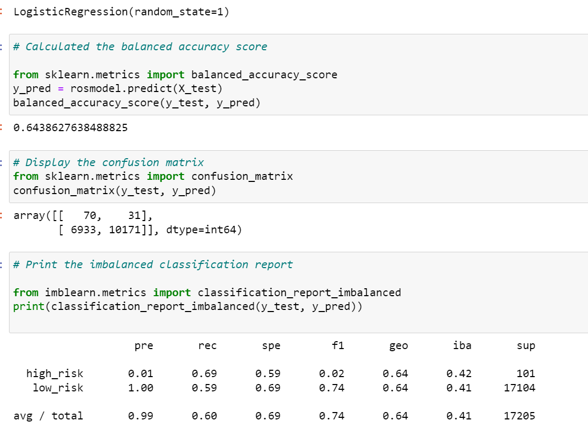
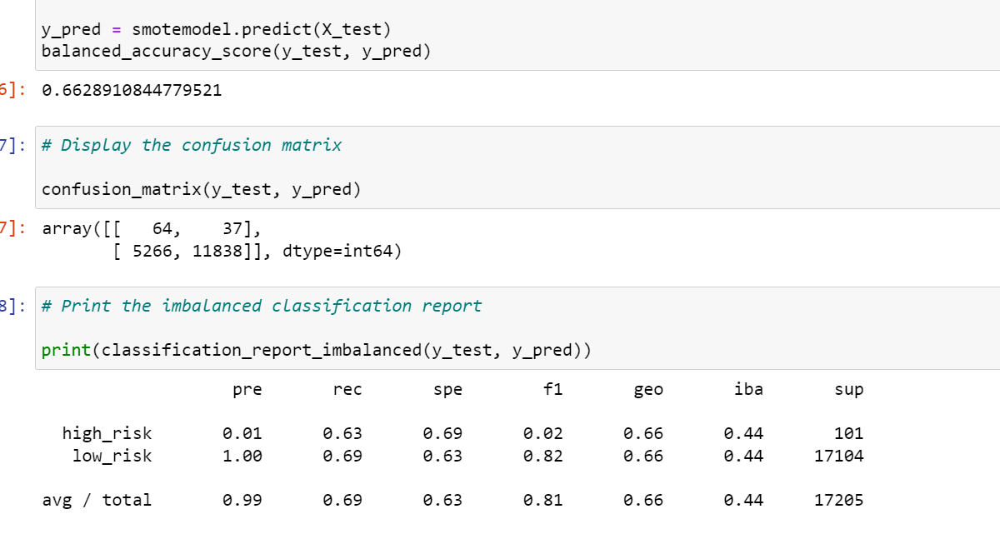
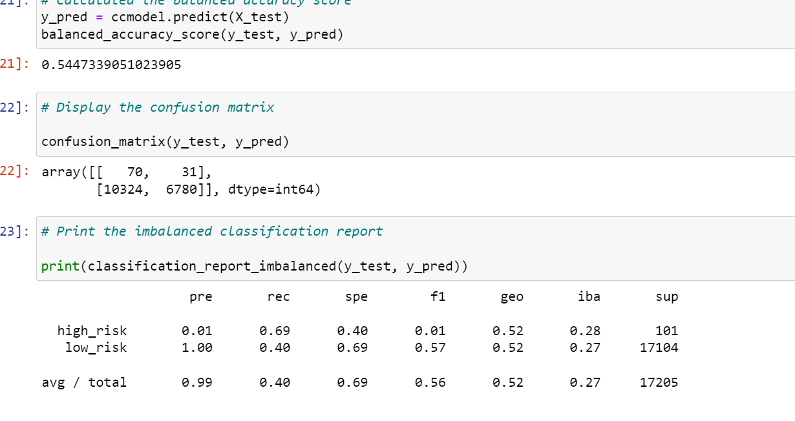
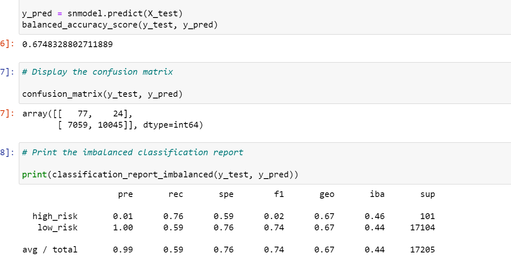
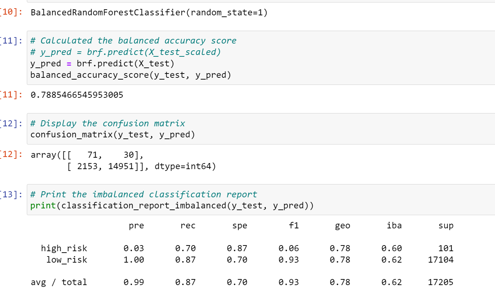
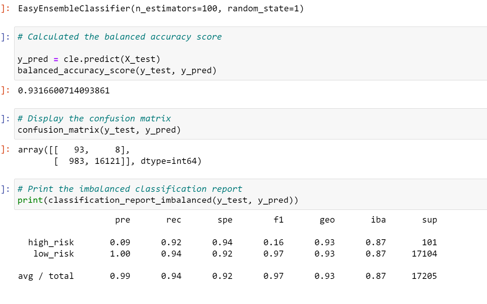

# Credit_Risk_Analysis

# Overview:

The purpose of this excercise is to utilize different machine learning models to make a prediction on loans risk analysis. Evaluate the performance of six different sampling models: RandomOverSampler, SMOTE, clusterCentroids, MOTEENN, BalancedRandomForestClassifier, EasyEnsembleClassifier. Then, recommend whether they should be used to predict credit risk.

# Results: 
  
   
 1. RandomOverSampler:
  
      - balanced accuracy score: 0.6438627638488825
      - precision score high risk loans: 0.01
      - precision score low risk loans: 1.00
      - recall score high risk loans: 0.69
      - recall score low risk loans: 0.59
  
    
  2. SMOTE:  
  
      - balanced accuracy score: 0.6628910844779521
      - precision score high risk loans: 0.01
      - precision score low risk loans: 1.00
      - recall score high risk loans: 0.63
      - recall score low risk loans: 0.69
   
     
  3. clusterCentroids: 
  
      - balanced accuracy score: 0.5447339051023905
      - precision score high risk loans: 0.01
      - precision score low risk loans: 1.00
      - recall score high risk loans: 0.69
      - recall score low risk loans: 0.40
   
      
  4. MOTEENN:
  
      - balanced accuracy score: 0.6748328802711889
      - precision score high risk loans: 0.01
      - precision score low risk loans: 1.00
      - recall score high risk loans: 0.76
      - recall score low risk loans: 0.59

     
  5. BalancedRandomForestClassifier:
  
      - balanced accuracy score: 0.7885466545953005
      - precision score high risk loans: 0.03
      - precision score low risk loans: 1.00
      - recall score high risk loans: 0.70
      - recall score low risk loans: 0.87

   
   
  6. EasyEnsembleClassifier:
  
      - balanced accuracy score: 0.9316600714093861
      - precision score high risk loans: 0.09
      - precision score low risk loans: 1.00
      - recall score high risk loans: 0.92
      - recall score low risk loans: 0.94
 
# Summary: 

  - From the summary table, the balanced accuracy scores ranges from 0.54 to 0.93.  ClusterCentroids method has the lowest score and EasyEnsembleClassifier has the highest score.  Since EasyEnsembleClassifier has highest accuracy score, this also means that it has the higest percentage of correct predictions. 
  
  - The precision scores of low risk loans are the same in all six sampling methods, score of 1.  This means all methods can predict low risk loans with the same precision.
  
  - The precision scores of high risk loans are the same, 0.01, for all four resampling methods, RandomOverSampler, SMOTE, ClusterCentroids, and SMOTEENN.  However, the two ensemble methods, BalancedRandomForestClassifier and EasyEnsembleClassifier, have higher scores 0.03 and 0.09, respectively.  Since the best value is 1 and the worst value is 0, EasyEnsembleClassifier in this case is the best method.
  
  - The recall scores are less consistence between methods.  In The high risk loans, the scores range between 0.63 to 0.92.  SMOTE has the lowest score of 0.63 and EasyEnsembleClassifier has the highest score of 0.92.  In the low risk loans, the scores range between 0.40 to 0.94, EasyEnsembleClassifier has the highest score of 0.94. Again, the best value is 1 and the worst value is 0, EasyEnsembleClassifier in this case is the best method.
   
   - Based on the above evaluation, I recommend the EasyEnsembleClassifier for predicting loans risk, due to the fact that it has the highest accuracy scores, precision scores, and recall scores.
